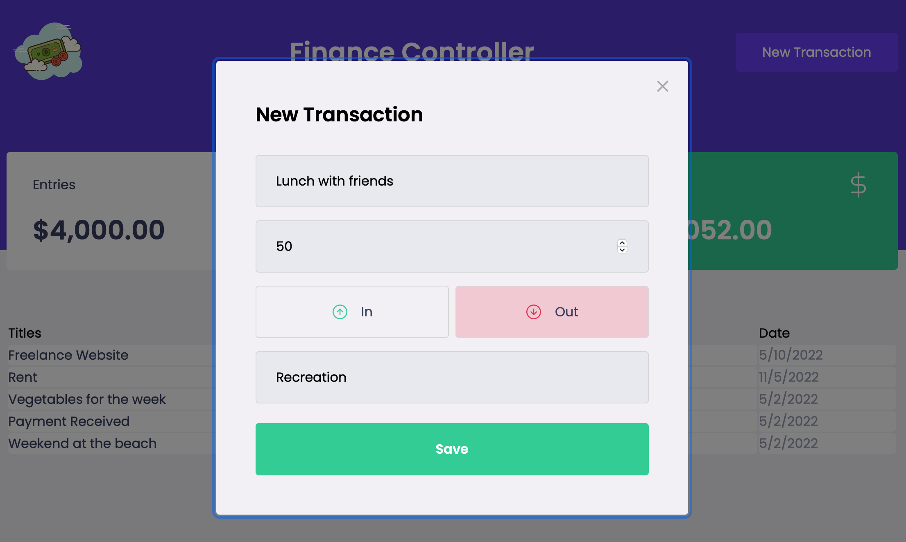
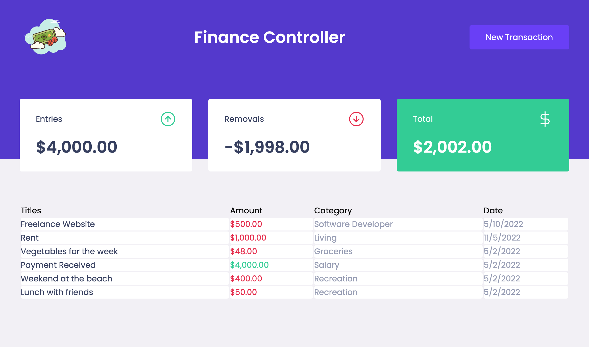

# Finances Controller

An React app using TypeScript - It was done following classes from [RocketSeat](https://www.rocketseat.com.br) Ignite Program. 
In this class we learnt different tools and concepts like (I'll write them down in order by relevance): 
- Hooks 
- Context
- Using Provider and Consumer
- MirageJs to fake API requests without the need of an backend. 
- StyledComponents
- INTL to currency formating. 

To run this app simply go to the project directory and run **`yarn start`** on the terminal. 

